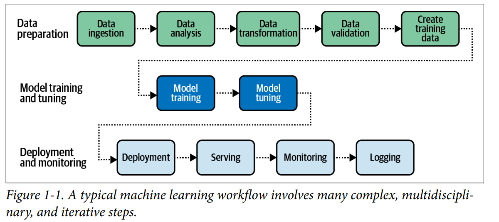

# Benefits of Cloud Computing

## Key Points:
- Cloud computing enables on-demand access to IT resources via the internet.
- Pay-as-you-go pricing model eliminates the need for maintaining physical infrastructure.
- AWS offers a wide range of services, including AI and ML, built on decades of expertise.

### 1. Agility

Cloud computing enables quick and easy resource deployment for rapid experimentation. Users can test new tools or enhance processing with minimal risk, as resources can be quickly scaled up and then decommissioned if experiments fail.

### 2. Cost Savings

Cloud computing helps us save money by allowing us to pay only for the compute resources we use, without making upfront investments in hardware. We can cut costs further by using Amazon EC2 Spot Instances, which offer up to a 90% discount on unused AWS capacity. Additionally, Reserved Instances and Savings Plans provide savings through prepaid options.

### 3. Elasticity
Cloud computing allows for automatic scaling of resources to align with application demands. For instance, if a data science application experiences a surge in model requests, resources can be scaled up automatically. Conversely, when demand decreases, the resources scale down. This eliminates the need for overprovisioning resources to manage peak loads.

### 4. Innovate Faster
Cloud computing speeds up innovation by freeing us from the time-consuming management of infrastructure. It allows businesses to focus on developing unique applications and experimenting with new algorithms, frameworks, and hardware quickly, reducing setup times from months to seconds.

### 5. Deploy Globally in Minutes
Cloud computing enables rapid global deployment of data science applications, allowing businesses to serve customers worldwide efficiently. AWS uses a network of Regions and Availability Zones (AZs), which are clusters of data centers located around the world. This structure not only facilitates proximity to customers, enhancing application performance and response times, but also helps in adhering to local data-privacy laws. The number of AWS Regions and AZs is expanding continuously to support wider global coverage.

 

## Data Science Pipelines and Workflows

 

## Pipelines:
- ### Amazon SageMaker:
#### are the standard, full-featured, and most complete wayto implement AI and machine learning pipelines on Amazon SageMaker. 

- ### Kubeflow Pipelines:
#### is a relatively new ecosystem built on Kubernetes that includes an orchestration subsystem called Kubeflow Pipelines. With Kubeflow, we can restart failed pipelines, schedule pipeline runs, analyze training metrics, and track pipeline lineage.

- ###  Apache Airflow on AWS:
#### popular option primarily built to orchestrate data engineering and extract-transform-load (ETL) pipelines.

- ### MLflow: 
#### MLflow is an open source project that initially focused on experiment tracking but now supports pipelines called MLflow Workflows. We can use MLflow to track experiments with Kubeflow and Apache Airflow workflows as well

