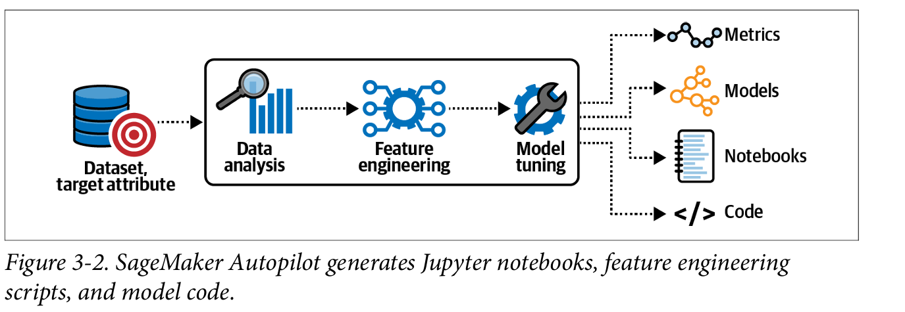
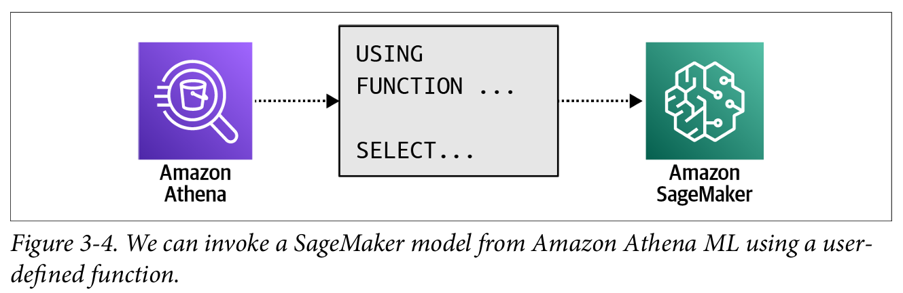

**SageMaker Autopilot:** simplifies the process of creating machine learning models by automating the entire pipeline. Users provide raw data in a tabular CSV format stored in an S3 bucket and specify the target column. SageMaker Autopilot analyzes the data, identifies the appropriate machine learning problem type (regression, binary classification, or multiclass classification), and selects suitable algorithms such as logistic regression, XGBoost, and neural networks. It generates code for data transformation, model training, and tuning, which users can modify and rerun. After training multiple model pipelines in parallel, it ranks the models based on metrics like accuracy, AUC, and F1-score. Unlike nontransparent AutoML services, SageMaker Autopilot provides full visibility and control over the chosen algorithms, data transformations, and hyperparameters.

-  SageMaker Autopilot doesn’t just share the models; it also logs all observed metrics and generates Jupyter notebooks, which contain the code to reproduce the model pipelines. 

- Amazon Athena is an interactive query service that lets us analyze data stored in S3 using standard SQL. Since Athena is serverless, we don’t need to manage any infrastructure, and we only pay for the queries we run. With Athena, we can query large amounts of data (TB+) without needing to move the data to a relational database. We can now enrich our SQL queries with calls to a SageMaker model endpoint and receive model predictions. 

To call SageMaker from Athena, we need to define a function with the USING
FUNCTION clause. Any subsequent SELECT statement can then reference the function to invoke a model prediction.

-  Amazon Comprehend is a fully managed AI service for natural language processing
 (NLP) tasks using AutoML to find the best model for our dataset. Amazon Compre
hend takes text documents as input and recognizes entities, key phrases, language,
 and sentiment. Amazon Comprehend continues to improve as new language models
 are discovered and incorporated into the managed service.
 

[The Best Amazon SageMaker Alternatives [for Experiment Tracking and Model Management]](https://neptune.ai/blog/amazon-sagemaker-alternatives)